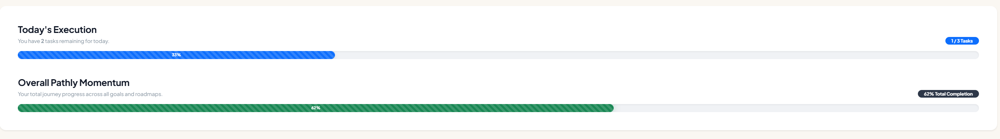

# **PATHLY**

> **Bridge the gap between high-level ambition and daily execution with Micro-Strategic Planning.**


## Table of Contents
- [About](#about)
- [User Flow](#user-flow)
- [Features](#features)
- [Technologies Used](#technologies-used)
- [Setup and Installation](#setup-and-installation)
- [Architecture & Best Practices](#architecture--best-practices)
- [Future Roadmap](#future-roadmap)
- [Licence](#license)

## **About**

Pathly is a strategic productivity tool designed to bridge the gap between high-level ambition and daily execution. 

It was made so you can the right tools to set your mountain, find your exact strategy to climbing it and then help you conquer the top.  
With Pathly you don't have to ask yourself "Is this even possible" - Yes it is. You set a goal, break it into daily tasks and execute them - it's that easy.

### *The "Why"*

I am very ambitious myself and I want to achieve many things - sometimes too many at once. So sometimes I have too many tasks at once and I start forgetting, 
mixing stuff up and just could not get my mind right. First I tried writing on paper but let's be real this is not the most convinient way in this modern era. 
Then I tried looking for a task-tracking app or something that will help me organize my thoughts but every app had either too many features or not the right ones. 
Then it hit me - why don't I built the perfect app myself! And that's how Pathly came to life.

### *The purpose*
 
The core philosophy of Pathly is "Micro-Strategic Planning." Instead of just listing chores, Pathly encourages users  
to categorize their efforts into three distinct layers:  
 
- Goals: Your mountain top. These represent the long-term outcomes you are trying so hard for.  
 
- Roadmaps: The strategy. These allow you to break down a massive goal into logical phases or milestones.  

- Tasks: The small steps. These are the daily "micro-actions" that actually move you closer to achieving your goals.  
 
Whether you are learning a new language, building a startup, or just trying to organize your personal growth, 
Pathly provides the structure to ensure that what you do today actually matters for where you want to be tomorrow.

## User Flow

### *The Pathly Workflow*

* **Define the North Star:** Create a Goal with a target date and an "Ideal Outcome."

* **Strategize:** Generate a Roadmap to bridge the gap between your current state and your goal.

* **Breakdown:** Deconstruct the roadmap into specific Actions (Milestones).

* **Execute:** Link your daily Tasks to these actions and watch your momentum bars grow.

## **Features**

Full CRUD Operations: Manage Goals, Roadmaps, and Tasks with a seamless interface.

Dynamic Dashboard: Real-time overview of progress and a daily reminder of how far you have gone.



#### *Visualizing daily execution vs. long-term journey completion.*

\
Responsive Sidebar Navigation: A custom-built, collapsible navigation system for a focused workspace.

Interactive Roadmap Selection: View and filter specific paths toward your goals. After creating one 
you can breake your milestones into daily tasks

Robust Validation: Comprehensive client-side and server-side data integrity.

## **Technologies Used**

### *Backend & Framework:* 

* **[ASP.NET Core 8 (MVC)](https://learn.microsoft.com/en-us/aspnet/core/mvc/overview):** Utilized for high-performance, cross-platform web architecture.

* **[ASP.NET Core Identity](https://learn.microsoft.com/en-us/aspnet/core/security/authentication/identity):** For secure, encrypted user authentication and account management.

* **[Entity Framework Core](https://learn.microsoft.com/en-us/ef/core/):** Leveraged as a modern ORM for database mapping and migrations.

* **LINQ (Language Integrated Query):** Used for complex data filtering and aggregation for the dashboard.

### *Database:*

* **[Microsoft SQL Server](https://www.microsoft.com/en-us/sql-server/sql-server-downloads):** For relational data storage and integrity.

* **Database Transactions:** Implemented to ensure atomicity during account deletion and multi-step data pruning.

### *Frontend & UI/UX:*

* **[Bootstrap 5](https://getbootstrap.com/docs/5.3/getting-started/introduction/):** For a responsive, mobile-first grid system.

* **Razor Views & Partial Views:** Used for modular, reusable UI components (Modals, Sidebars).

* **[SweetAlert2](https://sweetalert2.github.io/):** For high-end, interactive user confirmation dialogues.

* **[Bootstrap Icons](https://icons.getbootstrap.com/):** For a consistent and intuitive visual language.

* **CSS3 Animations:** Custom `@keyframes` for smooth transitions and the "Pathly" brand feel.

### *JavaScript & Client-Side:*

* **ES6+ JavaScript:** For DOM manipulation and asynchronous form handling.

* **AJAX:** For seamless data loading (Roadmap selection and Task filtering).

* **Client-Side Validation:** [JQuery Validation](https://jqueryvalidation.org/) and Unobtrusive Validation for real-time error handling.

## **Setup and Installation**

### *Prerequisites*

* **Target Framework:** [.NET 8.0 SDK](https://dotnet.microsoft.com/download/dotnet/8.0)

* **IDE:** [Visual Studio 2022](https://visualstudio.microsoft.com/vs/) 

* **Database Engine:** [SQL Server Express](https://www.microsoft.com/en-us/sql-server/sql-server-downloads), Developer Edition, or LocalDB.

#### **Optional:**

* **[SSMS](https://learn.microsoft.com/en-us/sql/ssms/download-sql-server-management-studio-ssms):** to manage the SQL Server DB

### *Tools:*

* **[Git](https://git-scm.com/):** To clone the repository.

* **EF Core Tools:** (Optional, but recommended) dotnet tool install --global dotnet-ef

* **Modern Browser:** to view the CSS3 animations and flex-layouts correctly.

### *Step-by-Step Instructions*
 
#### **1.Clone the repository**

Open `Git Bash` in the directory you want to download the project and run this command to clone it:

```Bash
 
git clone https://github.com/YourUsername/Pathly.git
 
```

#### **2.Configure the Database**
 
After you have successfully loaded the project in Visual Studio. Navigate to `appsettings.json` \(in the `Web` solution folder\) and update the connection string to point to your local SQL Server instance:

``` JSON
 
"ConnectionStrings": {
 "DefaultConnection": "Server=(localdb)\\mssqllocaldb;Database=PathlyDb;Trusted_Connection=True;MultipleActiveResultSets=true"}
 
```

You can name your database however you like by changing this part:

```PlainText
Database=YourOwnDbName
```

#### **3.Apply Migrations**

Open the **Package Manager Console** in Visual Studio and run:

```PowerShell
 Update-Database
```

**Note!**: Make sure that the **Default Project** is set to `Pathly.Web` 

#### **4.Run the Application:**
Press `F5` or click the `"Start"` button in Visual Studio. The application will launch at:

```PlainText
https://localhost:7xxx.
```

**Note!**: If it does not start check if the **startup project** is set to `Pathly.Web` and that next to the start/play button says `https`.  
To configure the startup project: `Right Click on the solution > Configure Startup Project > Check Single Startup Project` and then select Pathly.Web from the dropdown menu.

## **Architecture & Best Practices**
This project is built with a focus on maintainability and clean code, following these core principles:

### *MVC Pattern Architecture*

#### The project is strictly organized using the Model-View-Controller design pattern to ensure a clean separation of concerns:

* **Models**: Represent the core data structures and business logic. This includes the `Goal`, `Roadmap`, and `Task` entities. They utilize **Data Annotations** (`[Required]`, `[MaxLength]`)
   to enforce data integrity directly at the database level.

* **Views**: Built with **Razor Syntax**, the views are responsible for the presentation layer. By using **Layouts** and **Partial Views**, the UI remains consistent across the application while
  remaining decoupled from the underlying logic.

* **Controllers**: Act as the intermediary "brain." They handle incoming HTTP requests, interact with the `ApplicationDbContext` to retrieve or update data, and return the appropriate
  `View` or `Redirect`.

### *DB realationships of entity models*


Pathly utilizes a relational schema centered around the AspNetUsers table to ensure data isolation. The hierarchy follows a strict One-to-Many flow: a single User can own multiple Goals, 
each containing dedicated Roadmaps. These Roadmaps are broken down into Actions, which serve as milestones. Finally, daily Tasks are linked to these Actions, creating a traceable path 
from a daily to-do item back to a high-level ambition. The schema also includes a Many-to-Many relationship between Tasks and Tags via the TaskTags join table, allowing for flexible cross-goal organization.

### *Used Principles:*

* *Single Responsibility:* Controllers manage HTTP requests, while the Database Context handles data persistence.
* *Open/Closed:* The architecture allows for adding new goal types or roadmap structures without modifying existing core logic.
* **Dependency Injection (DI):** Utilizes the built-in .NET IoC container to manage the lifecycle of the `ApplicationDbContext` and other services.
* **Data Validation:** Implements a dual-layer validation strategy using **Data Annotations** for server-side checks and **jQuery Validation** for real-time client-side feedback.
* **DRY (Don't Repeat Yourself):** Extensive use of **Razor Layouts**, **Partial Views**, and **ViewSections** to ensure UI components are reused and easily updated.
* **Referential Integrity & Data Pruning:** Implemented custom recursive deletion logic to handle **Foreign Key Constraints** across complex one-to-many and many-to-many relationships, 
   ensuring the database remains clean without orphaned records.

## **Future Improvements**

### *Future Roadmap*

#### Pathly is continuously evolving. Planned features for upcoming releases include:

* **Social Accountability:** The ability to share goals and key milestones with a community of users for mutual encouragement and public "Path" tracking.

* **AI-Assisted Deconstruction:** Integration with LLMs to suggest logical milestones and roadmap structures based on the user's high-level goal.

* **Data Analytics Suite:** Advanced insights into productivity trends, helping users identify which "Paths" are thriving and where focus is lagging over time.

## **License**

Distributed under the **MIT License**. See the `LICENSE` file in the root directory for more information.
